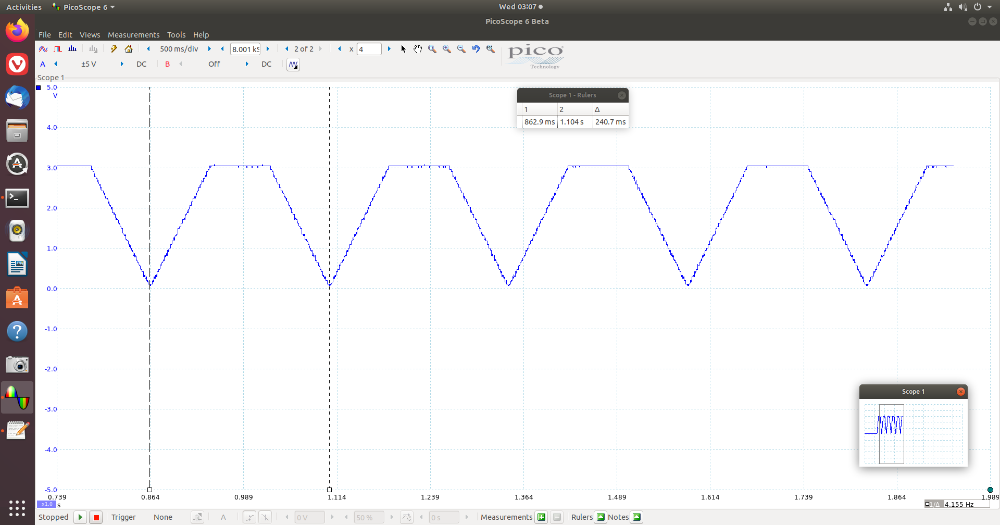
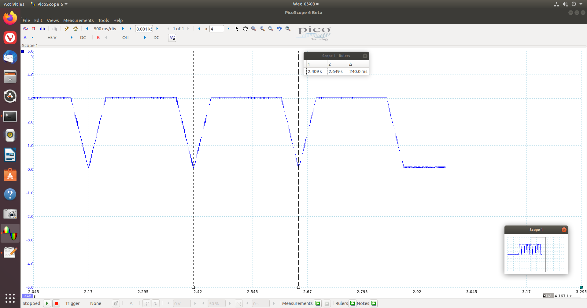
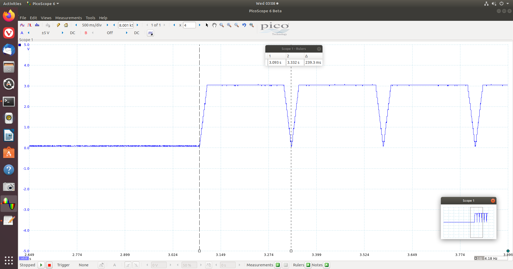
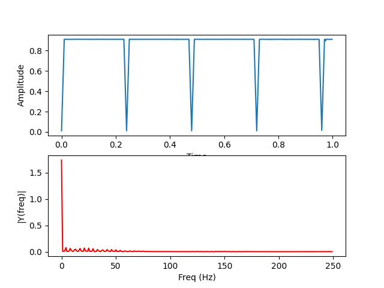

# Mid1

## How to set up and run my program
1. Compile the program
```
$ sudo mbed compile --source . --source ~/ee2405/mbed-os-build/ -m B_L4S5I_IOT01A -t GCC_ARM -f
```
2. Excute FFT.py 
```
$ sudo python3 FFT.py
```
>The python script will automatically set the sample rate according the message send by the board, so you don't need to edit it when select different frequency wave.
>It also show the progress of the data transfer.
3. Use button to choose  frequency of signal.
4. Push 'sel button' to start genatare and sample the wave.
>After push the 'sel button' the board will start to genarate wave for about 2s.
5. Get output result.

## Result

### Frequency response and wave diagram
|   |1|1/2|1/4|1/8|
|:-:|:-:|:-:|:-:|:-:|
|**picoscope**|||||
|**FFT**      |||||

## breakboard

